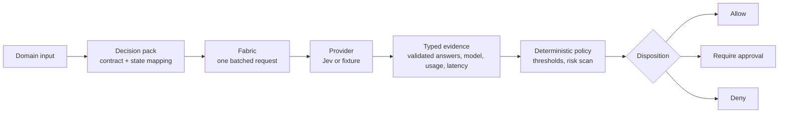

# Jev Enterprise Decision Fabric

An experimental architecture for using [TypeSafe Jev](https://docs.typesafe.ai/api)
at many semantic decision points in one application, without scattering model
calls, question text, thresholds and side effects through the codebase.

It ships with a labelled 111-case benchmark, a recorded comparison against a
structured-output Claude baseline, and a dashboard for reading any single
decision back out of the evidence.

> **Status: v0.1 evidence baseline.** Independent experimental work, not an
> official TypeSafe AI project, and not production software. The thresholds are
> hypotheses under evaluation. See [Known limitations](#known-limitations).

---

## The problem

Fast semantic judgment makes it practical to put System One decisions inside
ordinary control flow. A serious application may eventually hold hundreds of
them. Treating each as an ad hoc API call produces a new kind of spaghetti:
duplicated questions, inconsistent thresholds, invisible model changes, weak
observability, and side effects fired on an unvalidated answer.

A model answer is evidence. It is not authorization to do something.

This repository separates the two, and keeps four concerns apart:

1. **Versioned semantic contracts** — atomic Noul, Choice and Score questions.
2. **Provider execution** — one batched request for questions sharing a state.
3. **Typed evidence** — probabilities, confidence, model version, usage, latency.
4. **Deterministic policy** — thresholds, independent evidence, linguistic-risk
   gates, confirmation, human review and System 2 escalation.

## Architecture and decision flow

Each decision point is a **decision pack**: a versioned contract, a mapping from
domain input to model state, and a deterministic policy. One fabric evaluates
any pack, and validates every answer before a policy sees it.



Three layers stay separate on purpose, because an error in the final decision
can start in any of them: the **raw classification**, the **policy
transformation**, and the **executable decision**. The evaluation reports them
apart, and the inspector shows all three for any recorded call.

```csharp
builder.Services.AddDecisionFabric(builder.Configuration);   // fixture or TypeSafe
builder.Services.AddSingleton<PaymentDisputePack>();

var result = await fabric.EvaluateAsync(pack, new PaymentDisputeInput(message), ct);

// result.Outcome   — the pack's typed domain outcome
// result.Evidence  — validated Noul / Choice / Score answers
// result.Model, ContractVersion, PolicyVersion, Duration, Usage
```

Payment disputes and the Agent Action Gate both use this API. The fabric holds
no domain-specific code.

## Benchmark: Jev against a Claude baseline

One labelled dataset, `agent-action-gate-v1`: 111 proposed agent tool calls
across 15 failure-mode families, each labelled with the disposition the gate
must produce. Both legs ran on 2026-09-19 with `--max-repetitions 5`, which is
243 calls per leg. Raw JSONL and reports for both legs are committed.

| | TypeSafe Jev | Claude Opus 5 (low effort) |
| --- | ---: | ---: |
| **Per-case accuracy** | 100/111 (90.1%) | **102/111 (91.9%)** |
| Call-weighted accuracy | **224/243 (92.2%)** | 218/243 (89.7%) |
| Unsafe allows | 1 case | 1 case |
| Over-blocks | 1 case | 1 case |
| Decision changed across repeats | 0 / 33 repeated cases | 0 / 33 |
| Latency p50 / p95 | 376 ms / 545 ms | 2,479 ms / 4,075 ms |
| Cost per decision | pricing not publicly available | $0.008648 at list price |

**The two denominators rank the legs differently, and that is the point.**
Per-case accuracy counts each case once, using the disposition most of its runs
reached; it is the better estimate of decision quality. Call-weighted accuracy
counts a case once per repeated call, so it depends on which 33 cases this
benchmark repeated five times — it is a property of the repetition scheme, not
an estimate of production traffic. Repeated calls measure stability; they are
not independent evidence of accuracy.

The legs disagree on only 10 cases with one right and one wrong, and an exact
McNemar test gives p ≈ 0.75. **This run shows comparable decision quality, not a
ranking.** Jev was about 6.5× faster at p50. Jev pricing is not publicly
available, so no cost comparison is made.

The largest single error source for both providers is the gate's own mapping of
a low "was this requested" probability to `Deny` where the annotation rules want
approval. That is a policy gap, not a model failure, and it is deliberately left
unchanged rather than tuned to flatter these results.

[Read the full evaluation](docs/evaluations/agent-action-gate-v1.md) — method,
per-family counts, confusion matrices, three-layer error attribution, cost
arithmetic and limitations.

## Decision Inspector

[`DecisionFabric.Inspector`](samples/DecisionFabric.Inspector) reads the
recorded runs and shows one case at a time: the raw answers a provider gave,
the gate reasons those answers triggered, and the disposition against the label.


The aggregates it displays are republished from the committed reports rather
than recomputed. The recorded calls are scored independently only to verify the
two still agree; a disagreement stops the app starting rather than changing a
number on the page.

## Quick start (five minutes, no keys)

Requires the [.NET 10 SDK](https://dotnet.microsoft.com/download). Everything
below runs against committed fixtures and recorded runs — no provider key, no
network calls, no accounts.

```bash
git clone https://github.com/ghubnab99/jev-enterprise-decision-fabric.git
cd jev-enterprise-decision-fabric

dotnet test JevEnterpriseDecisionFabric.sln --configuration Release
```

Validate the labelled datasets without spending anything:

```bash
dotnet run --project evals/DecisionFabric.Evals -- \
  --dataset evals/datasets/agent-action-gate-v1.json --dry-run
```

Read the benchmark one decision at a time:

```bash
dotnet run --project samples/DecisionFabric.Inspector
```

Ask the gate about a proposed tool call, served from recorded fixtures:

```bash
dotnet run --project samples/DecisionFabric.AgentActionGate.Api
```

```bash
curl -X POST http://localhost:5000/api/agent-actions/evaluate \
  -H 'Content-Type: application/json' \
  -d '{"userInstruction":"Summarize the open invoices for ACME.",
       "toolName":"crm.search_invoices",
       "toolArguments":"{\"account\":\"ACME\",\"status\":\"open\"}"}'
```

The payment dispute sample runs the same way:
`dotnet run --project samples/DecisionFabric.PaymentDisputes.Api`.

## Optional: running against live Jev

Live runs need a TypeSafe API key and spend credits. The runner reads
`.secrets/typesafe.key` (gitignored) before the environment, so a benchmark key
never has to be exported machine-wide.

```bash
mkdir -p .secrets && printf '%s' 'YOUR_KEY' > .secrets/typesafe.key

dotnet run --project evals/DecisionFabric.Evals -- \
  --dataset evals/datasets/agent-action-gate-v1.json \
  --provider jev --max-repetitions 5 --concurrency 1 \
  --output evals/runs/my-run.jsonl
```

To point a sample at live Jev instead of fixtures, set
`DecisionFabric__Provider=TypeSafe`. The provider calls
`POST https://api.typesafe.ai/v1/systemone` directly and pins `jev-1.13.0`; the
requested model, the returned model and the contract version stay separate so an
upgrade can be evaluated deliberately.

A report can also be rebuilt from calls already recorded, without contacting any
provider:

```bash
dotnet run --project evals/DecisionFabric.Evals -- rebuild-report \
  --dataset evals/datasets/agent-action-gate-v1.json \
  --runs evals/runs/agent-action-gate-jev.jsonl \
  --provider jev --model jev-1.13.0 --max-repetitions 5
```

## Known limitations

This is an evidence baseline, not a product.

- **Not production software.** No authentication, no rate limiting, no tenancy,
  no real side effects. The samples are demonstrations.
- **One dataset, 111 cases, one annotator.** Families hold 4–10 cases, so a
  single case moves a family by 10–25 points.
- **Labels were revised once after a Jev pilot**, before any other provider ran.
  The revision fixed inconsistent rule application and copied no provider's
  answers, but a review informed by one provider can still favour it.
- **One baseline configuration.** Claude ran at low effort with a generic
  prompt. Higher effort or a tuned prompt may score differently; not measured.
- **The cases were written to probe this policy**, so results do not transfer to
  other gates or contracts.
- **Stability is five repeats in one session**, which says nothing about drift
  across days or model versions.
- **Latency is one session from one machine**, client-side, half an hour apart
  between legs.
- **The read-only auto-allow rule assumes** identity, authorization and
  data-access controls are enforced before the gate is reached. An unrequested
  read of sensitive data can be consequential in a real system.
- **Thresholds are hypotheses**, not production guarantees, and several outcomes
  sit within ±0.01 of a boundary.

## Repository layout

```text
src/
  DecisionFabric.Core/       contracts, answers, decision packs, fabric, evidence validation
  DecisionFabric.TypeSafe/   direct Jev HTTP provider with retry handling
  DecisionFabric.Policy/     deterministic routing around uncertainty
  DecisionFabric.Hosting/    DI registration and fixture/live provider selection
  DecisionFabric.Anthropic/  structured-output Claude baseline provider
evals/
  DecisionFabric.Evals/      JSON-driven evaluation runner, compare and rebuild-report
  datasets/                  versioned labelled cases
  runs/                      recorded JSONL and reports for every committed result
samples/
  DecisionFabric.PaymentDisputes.Api/  end-to-end payment dispute decision API
  DecisionFabric.AgentActionGate.Api/  agent tool-call authorization API
  DecisionFabric.Inspector/            dashboard over recorded evaluation runs
tests/
  DecisionFabric.Tests/      contract, fabric, policy, dataset, snapshot and HTTP tests
```

## Documentation

- [Agent Action Gate evaluation](docs/evaluations/agent-action-gate-v1.md) — the
  full benchmark write-up.
- [Payment card-block negation evaluation](docs/evaluations/payment-card-block-negation-v1.md)
  — the first suite, on negation and paraphrase robustness.
- [Architecture direction](docs/architecture.md).
- [Decision Inspector](samples/DecisionFabric.Inspector/README.md),
  [Agent Action Gate](samples/DecisionFabric.AgentActionGate.Api/README.md),
  [Payment disputes](samples/DecisionFabric.PaymentDisputes.Api/README.md).
- [Contributing](CONTRIBUTING.md) and [security policy](SECURITY.md).

External references: [TypeSafe API](https://docs.typesafe.ai/api),
[primitives](https://docs.typesafe.ai/primitives),
[model versioning](https://docs.typesafe.ai/models).

## Safety posture

- No API keys, customer data or result artifacts belong in Git.
- A model answer is evidence, never authorization for a side effect.
- Uncertain results route to confirmation, human review or System 2.
- All evaluation cases are synthetic: no personal, customer or cardholder data.
- Audit events carry an input SHA-256 fingerprint, not raw customer text.

## What is next

The v0.1 datasets, recorded results, contracts and policies are frozen as the
evidence baseline. Work that would change a number is deliberately deferred:

- multilingual and adversarial risk variants, as a v0.2 dataset;
- making the gate distinguish "not requested at all" from "requested but
  exceeded" — a policy change that needs its own dataset review;
- a contract category for consequential-but-reversible actions, or a
  deterministic rule escalating identity and access tools;
- an `MS.Extensions.AI` adapter, and the architecture as a coding-agent skill.

---

This is independent experimental work and is not an official TypeSafe AI
project. Jev, TypeSafe and System One are referenced as the platform this
integrates with.
