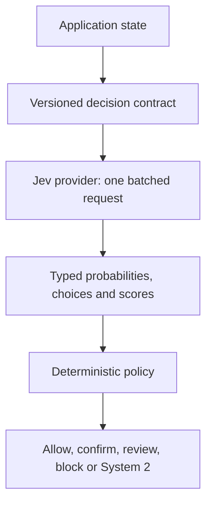

# Architecture direction

The Decision Fabric separates probabilistic semantic judgment from deterministic application policy.

## Invariants

1. Application code does not scatter raw Jev JSON or prompt strings across controllers and handlers.
2. Questions are versioned semantic contracts.
3. Questions sharing the same state are evaluated in one request unless a real dependency requires another request.
4. Probabilistic output never performs a consequential side effect directly.
5. Thresholds and fallback behavior belong to deterministic policy and are tuned against labelled evaluations.
6. The requested model version, returned model version, contract version, latency and full distribution are observable and replayable.

## Current slice

The first slice provides provider-neutral contracts, a direct Jev HTTP provider, deterministic Noul routing, a JSON-driven evaluation runner and a 140-run payment-negation suite. Payment and agent-safety samples will be built on this foundation after real evaluation results establish safe abstractions.
