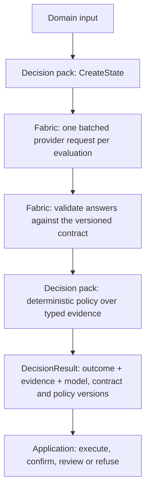

# Architecture direction

The Decision Fabric separates probabilistic semantic judgment from deterministic application policy.



## Invariants

1. Application code does not scatter raw Jev JSON or prompt strings across controllers and handlers.
2. Questions are versioned semantic contracts.
3. Questions sharing the same state are evaluated in one request unless a real dependency requires another request.
4. Probabilistic output never performs a consequential side effect directly.
5. Thresholds and fallback behavior belong to deterministic policy, live in validated configuration and are tuned against labelled evaluations.
6. The requested model version, returned model version, contract version, policy version, latency and full distribution are observable and replayable.
7. A consequential action requires agreeing evidence and must fail closed under uncertainty, confidence shortfall or linguistic risk.
8. Meaning-preserving variants are evaluated as declared metamorphic relations; threshold and primary-choice flips are explicit report data.
9. The fabric contains no domain knowledge. Every domain concept lives in a decision pack.

## Public API

```csharp
// A domain decision: contract + state mapping + deterministic policy.
public interface IDecisionPack<in TInput, out TOutcome>
{
    DecisionContract Contract { get; }
    string PolicyVersion { get; }
    JsonElement CreateState(TInput input);
    TOutcome Decide(TInput input, DecisionEvidence evidence);
}

public interface IDecisionFabric
{
    Task<DecisionResult<TOutcome>> EvaluateAsync<TInput, TOutcome>(
        IDecisionPack<TInput, TOutcome> pack,
        TInput input,
        CancellationToken cancellationToken = default);
}
```

Application code:

```csharp
// Registration: provider selection (Fixture | TypeSafe) and the fabric, once.
builder.Services.AddDecisionFabric(builder.Configuration);
builder.Services.AddSingleton<PaymentDisputePack>();

// Use: one call per decision point, typed outcome back.
var result = await fabric.EvaluateAsync(pack, new PaymentDisputeInput(message), ct);

return result.Outcome.Gate.Disposition switch
{
    DestructiveActionDisposition.Authorized          => BlockCard(result),
    DestructiveActionDisposition.RequireConfirmation => AskCustomerToConfirm(result),
    _                                                => NoAction(result)
};
```

## Responsibilities

| Component | Owns | Does not own |
| --- | --- | --- |
| `IDecisionPack` (domain) | Contract, input → state mapping, deterministic policy, deterministic signals such as linguistic risk | Transport, retries, answer validation |
| `DefaultDecisionFabric` (Core) | One provider request per evaluation, contract validation, provider-level telemetry, result metadata | Any domain type, threshold or side effect |
| `DecisionEvidence` (Core) | Guarantee that every contract question has an in-range answer of the right type and every choice is a declared option | Interpretation of the values |
| `IDecisionProvider` | Wire protocol (`TypeSafeDecisionProvider`) or canned answers (`FixtureDecisionProvider`) | Policy |
| `AddDecisionFabric` (Hosting) | Provider selection from configuration, DI registration | Pack registration or policy options |
| Application | Persistence, confirmation workflow, audit sink, side effects | Model calls |

A malformed or incomplete provider response raises
`DecisionContractViolationException` before any policy runs, so a policy never
sees a missing or out-of-contract answer.

## Policy versions

`PolicyFingerprint.Create(name, parameters)` hashes a pack's effective policy
parameters into a version such as `payment-dispute-gate/sha256:a0e9832f7842`.
It is attached to every `DecisionResult`, API response, audit event and trace,
so a threshold change is visible without relying on a manually bumped number.

## Current slice

Two packs run through the same fabric:

- **Payment disputes** — whether a customer message authorizes blocking a card.
  One free-text field; Noul + Choice + Score; destructive-action gate with
  confirmation. Fixtures are recorded from the live evaluation.
- **Agent Action Gate** — whether an agent's proposed tool call may run. Three
  input fields; user-request Noul, impact Choice, scope-expansion Score; a
  non-destructive allow route for read-only calls and approval for irreversible
  or external actions. Fixtures are synthetic.

The evaluation runner still calls `IDecisionProvider` directly with its JSON
dataset contracts; moving it onto packs is deliberately out of scope for this slice.
